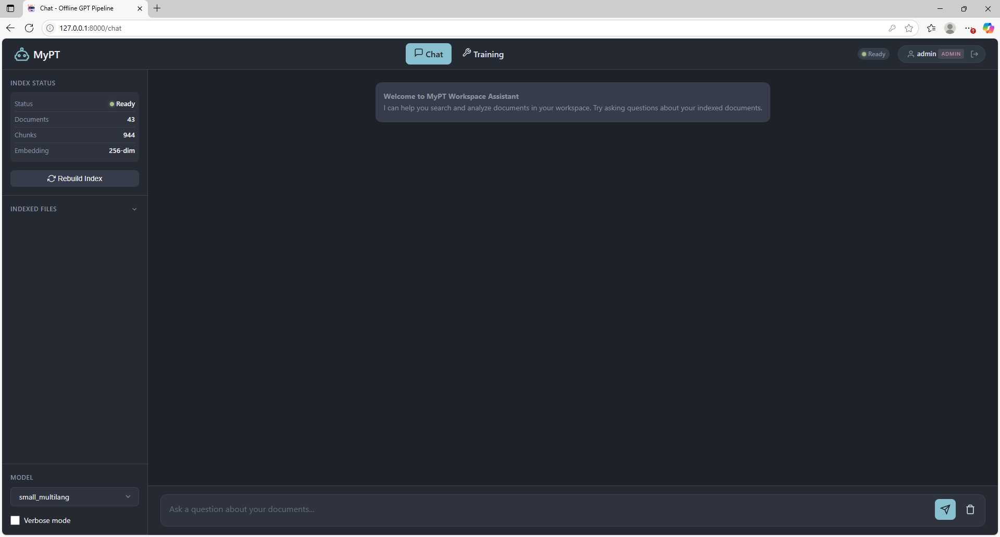

<p align="center">
  <pre align="center">
           o   o
           |   |
          .-----.
          | (o) |
          |  -  |
          '-----'
  </pre>
</p>

<h1 align="center">MyPT</h1>

<p align="center">
  <strong>Offline, Auditable AI Platform for Sensitive Environments</strong>
</p>

> **Project status:** Alpha (Phase 3 in progress)  
> MyPT features a **modern LLaMA-style architecture** (RoPE, SwiGLU, RMSNorm) with
> **curriculum training**, **gradient accumulation**, and **per-category evaluation**.
> End-to-end workflows (training, inference, RAG, auditing) are production-validated.
> The project is intentionally staged: correctness, traceability, and control first ?
> packaging, evaluation automation, and enterprise hardening later.

---

## Overview (60 seconds)

MyPT is a **fully local, offline AI platform** designed for organizations that
require GPT-like capabilities without sending data to external services.

Unlike most local AI tools, MyPT is built as a **complete AI system**, not a
runtime wrapper, with **reproducible domain adaptation workflows validated on
large-scale corpora**.

- model training and inference
- retrieval-augmented generation (RAG)
- agentic tool execution
- audit and compliance logging

All components run on customer-controlled infrastructure and are designed for
predictability, reproducibility, and operational transparency.

---

## What MyPT Is

- An **offline, on-prem AI platform** for sensitive environments
- A **full lifecycle system**: training ? inference ? RAG ? agents ? audit
- Designed to be **operated by non-LLM engineers**
- Built for **deterministic behavior, traceability, and control**

## What MyPT Is Not

- ? Not a ChatGPT or Ollama replacement
- ? Not a local chat toy or demo project
- ? Not a cloud SaaS
- ? Not a collection of scripts glued together

---

## Architectural Invariants

These constraints are non-negotiable by design:

- No external network calls at runtime
- Deterministic execution from configuration + random seed
- Explicit, allow-listed tool execution only
- No hidden prompt injection or side-channels
- Full plaintext audit trail for every operation
- Reproducibility prioritized over raw benchmark scores

---

## Core Use Cases

### 1. Offline AI for Sensitive Internal Knowledge

Organizations that cannot use cloud AI (legal, financial, industrial, regulated) can deploy MyPT to reason over internal documents while retaining full data control.

**Who this is for:**

- **Law Firms** ? Client privilege and confidentiality requirements
- **Healthcare** ? HIPAA, patient data protection
- **Financial Services** ? FINMA, SOX, GDPR, banking regulations
- **Defense & Government** ? Classified information, ITAR compliance
- **Pharmaceuticals** ? Trade secrets, research IP protection

### 2. Governed Agentic Workflows with Full Auditability

Teams can enable AI-assisted workflows using explicit tool calls, with every action, data flow, and decision fully logged and auditable.

**What you get:**

- Complete conversation visibility ? every prompt and response logged
- Tool call tracing ? all RAG retrievals, tool executions, and results
- No hidden operations ? every step of agent reasoning is inspectable
- Debug mode ? trace the full User ? RAG ? LLM ? Tools dataflow

---

## Is MyPT Right for You?

| Requirement                          | MyPT                      |
| ------------------------------------ | ------------------------- |
| Run AI fully offline / on-prem       | ?                        |
| Full audit trail of all interactions | ?                        |
| Explicit tool allow-list only        | ?                        |
| Deterministic, reproducible configs  | ?                        |
| Non-LLM engineers can operate it     | ?                        |
| "Best possible model quality"        | ? (bring your own model) |
| Consumer chatbot experience          | ?                        |

---

## Web Interface

<p align="center">
  
</p>

The MyPT web interface exposes the full AI lifecycle ? ingestion, indexing, inference, and auditing ? in a clear, operator-focused UI without hidden behavior.

---

## Platform Capabilities

- **Modern transformer architecture** with RoPE, SwiGLU, and RMSNorm (LLaMA-style)
- **Offline model training, fine-tuning, and inference** (10M to 750M+ parameters)
- **Curriculum training** with two-stage data scheduling and per-category evaluation
- **Gradient accumulation** for large effective batch sizes on limited hardware
- **Document-grounded reasoning via RAG** with local embeddings
- **Agentic workflows** with explicit, allow-listed tool execution
- **Full plaintext audit trail** (user, role, action, data flow)
- **Separate audit and debug logging** for compliance and troubleshooting
- **Deterministic presets** via JSON configuration files
- **Role-based access control** with JWT authentication
- **Docker deployment** with GPU support and persistent volumes

---

## Architecture at a Glance

```
???????????????????????????????????????????????????????????????
?                      Web UI / API                            ?
???????????????????????????????????????????????????????????????
?                    Policy & RBAC Layer                       ?
???????????????????????????????????????????????????????????????
?                     Agent Runtime                            ?
?              (Tool Allow-list, Orchestration)                ?
???????????????????????????????????????????????????????????????
?         RAG Pipeline              ?        Local Model       ?
?    (Indexer / Retriever)          ?   (Train / Inference)    ?
???????????????????????????????????????????????????????????????
?                  Plaintext Audit Log                         ?
?         (AUTH, CHAT, RAG, AGENT, TRAINING, ADMIN)            ?
???????????????????????????????????????????????????????????????
```

**Model architecture:** LLaMA-style transformer with Rotary Position Embeddings (RoPE),
SwiGLU gated MLP, and RMSNorm. Supports curriculum training with two-stage data scheduling,
gradient accumulation for large effective batch sizes, and per-category evaluation monitoring.

**Evaluation philosophy:**  
MyPT prioritizes _predictable behavior, traceability, and regression safety_,
including **explicit catastrophic-forgetting detection during domain adaptation**
and **per-category eval monitoring** (induction, retrieval, general, domain),
over headline benchmark scores;
evaluation exists to prevent silent degradation, not to chase SOTA metrics.

## Roadmap (High Level)

- Phase 0-1: Core model, infra, configs ?
- Phase 2: Domain pretraining & adaptation pipelines (validated) ?
- Phase 2.5: Architecture modernization (RoPE, SwiGLU, RMSNorm, grad accum) ?
- Phase 2.6: From-scratch training on 6B unified dataset (in progress)
- Phase 3a: Supervised fine-tuning (no tools)
- Phase 3b: Tool-calling SFT & agent traces
- Phase 4: Eval gates, regression suite, packaging

---

## Quick Start

### Installation

```bash
git clone https://github.com/yourusername/mypt.git
cd mypt
pip install -r requirements.txt
pip install -e .
```

### Launch Web Interface

```bash
python -m webapp.main --host 0.0.0.0 --port 8000
```

Open `http://localhost:8000` ? Default credentials: `admin:admin`, `user:user`

> ?? Change default passwords in production!

### Docker Deployment

```bash
docker-compose build
docker-compose -f docker-compose.yml -f docker-compose.gpu.yml up
```

See **[Docker Guide](docs/DOCKER.md)** for complete container deployment documentation.

---

## Offline Installation

For air-gapped environments:

```bash
# On internet-connected machine
pip download -r requirements.txt -d ./packages
pip download torch --index-url https://download.pytorch.org/whl/cu118 -d ./packages

# Transfer ./packages folder to offline machine

# On offline machine
pip install --no-index --find-links=./packages -r requirements.txt
pip install -e .
```

---

## Configuration Presets

| Config           | Parameters | Context | VRAM  | Use Case           |
| ---------------- | ---------- | ------- | ----- | ------------------ |
| `tiny.json`      | ~11M       | 128     | 2 GB  | Testing            |
| `small.json`     | ~40M       | 256     | 6 GB  | Development        |
| `150M.json`      | ~150M      | 256?512 | 12 GB | Production         |
| `200M.json`      | ~200M      | 256?512 | 16 GB | Production         |
| `350M_1024.json`        | ~350M | 1024 | 24 GB | High context                      |
| `750M_unified_v1.json`  | ~699M | 1024 | 40 GB | RAG-optimized (RoPE+SwiGLU+RMSNorm) |

---

## System Requirements

### Training

| Model Size | RAM   | GPU VRAM | Example GPU        |
| ---------- | ----- | -------- | ------------------ |
| Up to 50M  | 8 GB  | 4+ GB    | GTX 1650, RTX 2060 |
| 150M       | 16 GB | 8+ GB    | RTX 3060, RTX 3070 |
| 350M       | 24 GB | 16+ GB   | RTX 3090, RTX 4080 |
| 750M+      | 32 GB | 24+ GB   | RTX 4090, A100     |

### Inference

| Model Size | RAM  | GPU VRAM | Example GPU |
| ---------- | ---- | -------- | ----------- |
| Up to 50M  | 4 GB | ~1 GB    | GTX 1050    |
| 150M       | 6 GB | ~1.5 GB  | GTX 1060    |
| 350M       | 8 GB | ~2 GB    | GTX 1660    |
| 750M       | 8 GB | ~3 GB    | RTX 2060    |

---

## Training

```bash
# View available configurations
python scripts/utils/show_configs.py

# Train a model from scratch (Phase 1)
python train.py \
    --config_file configs/pretrain/150M.json \
    --model_name my_model \
    --input_file data/your_corpus.txt \
    --max_iters 10000

# Domain adaptation (Phase 2) with dual evaluation
python train.py \
    --config_file configs/pretrain/750M_1024_domain_adapt.json \
    --model_name domain_model \
    --dataset_dir data/domain_corpus \
    --init_from_model checkpoints/base_model \
    --eval_dataset_dir data/general_eval \
    --max_iters 65500
```

### Domain Adaptation (Phase 2)

Phase 2 is considered **complete** once a model demonstrates stable general
capability under continued pretraining, with domain improvements verified via
separate evaluation sets and reproducible training constraints.

Continue pretraining on domain-specific data while monitoring general capability:

- `--init_from_model` - Base model checkpoint for continued pretraining
- `--eval_dataset_dir` - Additional evaluation set to detect catastrophic forgetting
- Logs both metrics: `step 100: val 2.15 | eval_general 2.89`

See [Large Dataset Training Guide](docs/LARGE_DATASET_TRAINING.md) for details.

### Supervised Fine-Tuning (SFT)

Episode-indexed SFT training for conversations with **full reproducibility and audit traceability**.
Set `epoch_seed` in your config for deterministic training order?same seed always produces identical results.
See [Episode-Indexed SFT Guide](docs/EPISODE_INDEXED_SFT.md) for details.

---

## Inference

```bash
python generate.py \
    --model_name my_model \
    --prompt "Your prompt here" \
    --max_new_tokens 200
```

---

## RAG & Workspace

```bash
# Add documents
cp your_docs/*.md workspace/docs/

# Build search index
python scripts/build_rag_index.py \
    --docs_dir workspace/docs \
    --out_dir workspace/index/latest

# Interactive workspace chat
python scripts/workspace_chat.py --model_name my_model
```

---

## Auditing & Logging

MyPT provides enterprise-grade audit logging:

- **Category-based logging**: AUTH, CHAT, RAG, AGENT, TRAINING, ADMIN
- **Observability-ready format**: Pipe-separated logs for ELK, Splunk, Datadog
- **Daily log rotation** with configurable retention
- **Compliance support**: SOC 2, GDPR, HIPAA, ISO 27001

See **[Audit & Compliance Guide](docs/AUDIT_COMPLIANCE.md)** for details.

---

## Documentation

### Core Guides

| Document                                       | Description                 |
| ---------------------------------------------- | --------------------------- |
| [Installation Guide](docs/INSTALL.md)          | Detailed setup instructions |
| [Docker Guide](docs/DOCKER.md)                 | Container deployment & GPU  |
| [Web Application Guide](docs/WEBAPP_GUIDE.md)  | GUI documentation           |
| [Authentication](docs/AUTHENTICATION.md)       | User management & security  |
| [Audit & Compliance](docs/AUDIT_COMPLIANCE.md) | Audit logging & retention   |

### Training

| Document                                                   | Description                           |
| ---------------------------------------------------------- | ------------------------------------- |
| [Configuration Presets](docs/CONFIG_PRESETS.md)            | Model architecture options            |
| [Large Dataset Training](docs/LARGE_DATASET_TRAINING.md)   | Handling billions of tokens           |
| [SFT Loss Masking](docs/SFT_LOSS_MASKING.md)               | Fine-tuning techniques                |
| [Episode-Indexed SFT](docs/EPISODE_INDEXED_SFT.md)         | Deterministic conversation training   |
| [Episode Augmentation](docs/EPISODE_AUGMENTATION_GUIDE.md) | Expand gold episodes via paraphrasing |
| [Phase 3a Chat SFT Guide](docs/PHASE3A_CHAT_SFT_GUIDE.md)  | Fine-tuning 750M on gold episodes     |
| [Tool-call SFT](docs/toolcall_sft.md)                      | Training tool-using agents            |

### Inference & RAG

| Document                                       | Description                   |
| ---------------------------------------------- | ----------------------------- |
| [Generation Guide](docs/GENERATION_GUIDE.md)   | Sampling parameters & presets |
| [Workspace API](docs/workspace_api.md)         | Agentic RAG reference         |
| [Checkpoint Format](docs/CHECKPOINT_FORMAT.md) | Model storage format          |

---

## CLI Commands

| Command                | Description            |
| ---------------------- | ---------------------- |
| `mypt-train`           | Train a model          |
| `mypt-generate`        | Generate text          |
| `mypt-webapp`          | Launch web interface   |
| `mypt-workspace-chat`  | Interactive RAG chat   |
| `mypt-build-index`     | Build document index   |
| `mypt-prepare-dataset` | Create sharded dataset |
| `mypt-show-configs`    | List configurations    |

---

## Project Structure

```
MyPT/
??? train.py              # Training CLI
??? generate.py           # Generation CLI
??? core/                 # Core library
?   ??? model.py          # GPT implementation (RoPE, SwiGLU, RMSNorm)
?   ??? tokenizer.py      # GPT-2 BPE + character-level
?   ??? data_loader.py    # Sharded dataset support
?   ??? checkpoint.py     # JSON-based checkpoints
?   ??? agent/            # Agentic controller
?   ??? rag/              # RAG retriever
?   ??? workspace/        # Workspace tools
?   ??? embeddings/       # Local embedder
?   ??? compliance/       # Audit logging
??? webapp/               # Web application
??? configs/              # Model presets
??? scripts/              # Utility scripts
??? docs/                 # Documentation
```

---

## Contributing

Contributions are welcome. Please read our contributing guidelines before submitting PRs.

---

## License

MIT License ? See [LICENSE](LICENSE) for details.

---

<p align="center">
  <strong>Your data. Your model. Your control.</strong>
</p>
<p align="center">
  <em>Built for organizations that value sovereignty.</em>
</p>
