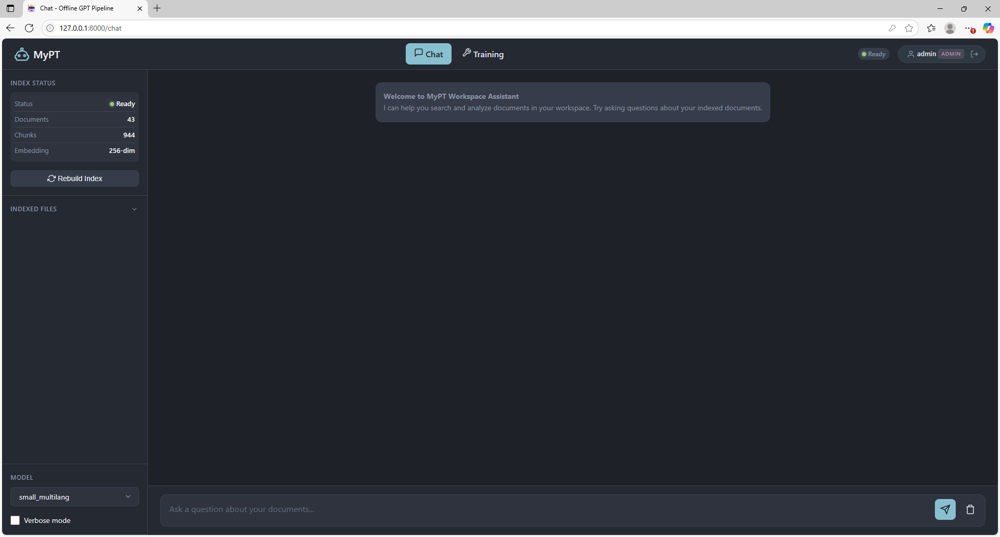

<p align="center">


</p>

<h1 align="center">MyPT</h1>

<p align="center">
  <strong>On-Premise governed AI Foundry</strong><br>
  <em>On-Premise governed Training and Inference System</em>
</p>

<p align="center">
  <code>pre-1.0</code>&nbsp;&nbsp;·&nbsp;&nbsp;<code>750M</code>&nbsp;&nbsp;·&nbsp;&nbsp;curriculum 1–6 complete&nbsp;&nbsp;·&nbsp;&nbsp;unsupported
</p>

---

## Overview (60 seconds)

MyPT is an **on-premise governed training and inference system**. You train a LLaMA-2-style model, run inference, and operate an agentic RAG loop on infrastructure you control. Nothing in the runtime path requires an external network.

It is a **full lifecycle system**, not a runtime wrapper:

- model training and inference
- retrieval-augmented generation (RAG)
- agentic tool execution
- audit and compliance logging

Training lineage (dataset mix **roles**, configs, eval gates) is documented in this repository. Tuned mix weights, measured eval results, trained checkpoints, and run history are **not** published.

## What MyPT Is

- An **On-Premise governed AI Foundry** — short name for an on-premise governed training and inference system
- A **full lifecycle**: train → infer → RAG → agents → audit
- Designed to be **operated by non-LLM engineers**
- Built for **deterministic behavior, traceability, and control**

## What MyPT Is Not

- Not a ChatGPT or Ollama replacement
- Not a local chat toy or demo project
- Not a cloud SaaS
- Not a collection of scripts glued together

---

## Status

> **Pre-1.0 and unsupported** at this tier. Resume from [`docs/sft/CURRENT_STATE.md`](docs/sft/CURRENT_STATE.md). Pretrain order: [`docs/training/README.md`](docs/training/README.md). SFT commands: [`docs/sft/SFT_PIPELINE_GUIDE.md`](docs/sft/SFT_PIPELINE_GUIDE.md).

| | |
| --- | --- |
| **Model** | ~750M, LLaMA-2-style (32 layers, 1280-d, 20 heads, 4096 context via position interpolation) |
| **Curriculum** | Phases 1–6 complete, including 6.2 (doc-id bind) and 6.3 (copy facts from `get_doc` tool results). A GOLD checkpoint exists for 6.3. Do not stitch answers in the RAG controller. |
| **1.4B** | Planned only. See [docs/sft/SCALE_1_4B.md](docs/sft/SCALE_1_4B.md). Do not start it from this tree’s 750M GOLD. |
| **Known gap** | `regression_basic` math. There is no real math corpus. Do not remediate it on 750M. |

The project is staged on purpose: correctness, traceability, and control first; packaging and enterprise hardening later.

---

## Architectural invariants

These constraints are non-negotiable by design:

- No external network calls at runtime
- Deterministic execution from configuration + random seed
- Explicit, allow-listed tool execution only
- No hidden prompt injection or side-channels
- Full plaintext audit trail for every operation
- Reproducibility prioritized over raw benchmark scores

---

## Core use cases

### 1. Offline AI for sensitive internal knowledge

Organizations that cannot use cloud AI can deploy MyPT to reason over internal documents while keeping data on their own infrastructure.

Typical settings: legal (client privilege), healthcare, financial services, government, and research IP — anywhere a document must not leave the building.

### 2. Governed agentic workflows with a full audit trail

AI-assisted workflows use **explicit** tool calls. Every action, retrieval, and decision is logged.

- Complete conversation visibility — prompts and responses
- Tool-call tracing — RAG retrievals, tool executions, results
- No hidden operations — each agent step is inspectable
- Debug mode — User → RAG → model → tools dataflow

## Is MyPT right for you?

| Requirement | MyPT |
| --- | --- |
| Run AI fully offline / on-prem | Yes |
| Full audit trail of all interactions | Yes |
| Explicit tool allow-list only | Yes |
| Deterministic, reproducible configs | Yes |
| Non-LLM engineers can operate it | Yes |
| “Best possible model quality” | No — bring your own training data |
| Consumer chatbot experience | No |

---

## Web interface

<p align="center">



</p>

The web UI exposes ingestion, indexing, inference, and auditing in an operator-focused layout. See [docs/webapp/WEBAPP_GUIDE.md](docs/webapp/WEBAPP_GUIDE.md).

---

## Platform capabilities

- **LLaMA-2-style transformer** — RoPE, SwiGLU, RMSNorm
- **Offline training, fine-tuning, and inference** (small presets through ~750M)
- **Curriculum SFT** with loss masking (assistant / tool spans only)
- **Gradient accumulation** for large effective batch sizes on limited hardware
- **Document-grounded RAG** with local embeddings and workspace tools
- **Agentic workflows** with an explicit tool allow-list
- **Plaintext audit trail** (AUTH, CHAT, RAG, AGENT, TRAINING, ADMIN)
- **Separate audit and debug logging**
- **JSON configuration presets**
- **Role-based access** with JWT authentication
- **Docker** with GPU support and persistent volumes
- **GGUF export** for llama.cpp (web UI or console)

---

## Architecture at a glance

```
+---------------------------------------------+
|                 Web UI / API                |
+---------------------------------------------+
|              Policy & RBAC layer            |
+---------------------------------------------+
|                Agent runtime                |
|         (tool allow-list, orchestration)    |
+----------------------+----------------------+
|     RAG pipeline     |     Local model      |
|  indexer / retriever |  train / inference   |
+----------------------+----------------------+
|         GGUF export (GOLD → llama.cpp)      |
|         web UI picker or console            |
+---------------------------------------------+
|            Plaintext audit log              |
|   AUTH, CHAT, RAG, AGENT, TRAINING, ADMIN   |
+---------------------------------------------+
```

GOLD checkpoints convert to a single GGUF file for llama.cpp. The RAG web UI and the console can serve that file; tool execution stays in the agent runtime. See [export/README.md](export/README.md).

Locked 750M fields (must appear in every SFT config so `train.py` can reconstruct the model):

| Field | Value |
| --- | --- |
| Style | LLaMA-2 (RoPE, SwiGLU, RMSNorm) |
| `n_layer` | 32 |
| `n_embd` | 1280 |
| `n_head` | 20 |
| `bias` | false |
| `tie_weights` | true |
| Context | 4096 (`rope_scale` 4.0 after Phase 1b) |
| Vocab | 50304 (GPT-2 50257 + 19 myPT special tags, padded to 64) |

Special tags (`<myPT_assistant>`, `<myPT_toolcall>`, …) are defined in [`core/special_tokens.py`](core/special_tokens.py). See [docs/sft/SFT_PIPELINE_GUIDE.md](docs/sft/SFT_PIPELINE_GUIDE.md) §1 and §4, and [docs/model/SPECIAL_TOKENS.md](docs/model/SPECIAL_TOKENS.md).

**Evaluation philosophy:** predictable behavior, traceability, and regression safety — including catastrophic-forgetting checks during domain adaptation and per-category eval monitoring — over headline benchmark scores. Evaluation exists to prevent silent degradation, not to chase SOTA.

---

## Quick start

### Installation

```bash
git clone https://github.com/chberclaz/MyPT.git
cd MyPT
python -m venv venv
# Windows: .\venv\Scripts\Activate
# Unix:    source venv/bin/activate
pip install -r requirements.txt
pip install -e .
```

Verify:

```bash
python -c "import torch; import tiktoken; from core import GPT; print('ok')"
```

### Launch the web interface

```bash
python -m webapp.main --host 0.0.0.0 --port 8000
```

Open `http://localhost:8000`. Default credentials: `admin:admin`, `user:user`. Change those passwords before any real deployment.

### Docker

```bash
docker-compose build
docker-compose -f docker-compose.yml -f docker-compose.gpu.yml up
```

See [docs/setup/DOCKER.md](docs/setup/DOCKER.md).

### Offline / air-gapped install

```bash
# On a machine with internet
pip download -r requirements.txt -d ./packages
pip download torch --index-url https://download.pytorch.org/whl/cu118 -d ./packages

# Transfer ./packages to the offline machine

pip install --no-index --find-links=./packages -r requirements.txt
pip install -e .
```

---

## Configuration presets

| Config | Parameters | Context | Typical VRAM | Use |
| --- | --- | --- | --- | --- |
| `configs/base/archiv/tiny.json` | ~11M | 128 | ~2 GB | Tests |
| `configs/base/archiv/small.json` | ~40M | 256 | ~6 GB | Development |
| `configs/base/archiv/150M.json` | ~150M | 256–512 | ~12 GB | Small production |
| `configs/base/archiv/350M_1024.json` | ~350M | 1024 | ~24 GB | Higher context |
| `configs/base/750M_unified_v1.json` | ~750M | 1024→4096 after Phase 1b | ~40 GB train | Current curriculum target |

List configs: `python scripts/utils/show_configs.py`. Details: [docs/reference/CONFIG_PRESETS.md](docs/reference/CONFIG_PRESETS.md).

### Training hardware (ballpark)

| Model size | RAM | GPU VRAM | Example GPU |
| --- | --- | --- | --- |
| Up to 50M | 8 GB | 4+ GB | GTX 1650, RTX 2060 |
| 150M | 16 GB | 8+ GB | RTX 3060 |
| 350M | 24 GB | 16+ GB | RTX 3090 |
| 750M | 32 GB | 24+ GB | RTX 4090, A100 |

Inference for 750M is a few GB of VRAM (more after GGUF quantization). See [export/README.md](export/README.md).

---

## Training

Order is fixed. Do not start SFT on a 1024-context checkpoint, and do not treat domain adaptation as an SFT phase.

```
1. Unified from-scratch pretrain
2. Domain corpus + continued pretrain
3. Context extension 1024 → 4096
4. SFT phases 1–6 (format-lock → operators → chat → multi-turn → toolcall → agentic)
```

Maps: [docs/training/README.md](docs/training/README.md) · [docs/sft/README.md](docs/sft/README.md). Resume: [docs/sft/CURRENT_STATE.md](docs/sft/CURRENT_STATE.md).

Replace `<RATIO>`, `<SEED>`, and checkpoint names with your own values. This project’s tuned numbers are not published.

### 1. Unified from-scratch pretrain

LLaMA-2-style ~750M, random init, mixed corpus (code + extractive Q&A + general text). Spec: [docs/training/01_UNIFIED_FROM_SCRATCH.md](docs/training/01_UNIFIED_FROM_SCRATCH.md).

```bash
python train.py \
    --config_file configs/base/750M_unified_v1.json \
    --model_name unified_v1_llama \
    --dataset_dir data/unified_phase1_circuit
```

For a hardware smoke test, a small archived preset (`configs/base/archiv/150M.json`) and `--input_file` still work. That is not the curriculum spine.

### 2. Domain corpus + adaptation

Build a domain dataset, then continued-pretrain the unified checkpoint. Keep a general holdout in `--eval_dataset_dir` so you can see catastrophic forgetting.

- Builder: [docs/training/02_DOMAIN_CORPUS.md](docs/training/02_DOMAIN_CORPUS.md)
- Adaptation: [docs/training/02_DOMAIN_ADAPTATION.md](docs/training/02_DOMAIN_ADAPTATION.md)

```bash
python train.py \
    --config_file configs/base/750M_unified_v1.json \
    --model_name domain_model \
    --dataset_dir data/domain_mixed \
    --init_from_model checkpoints/unified_v1_llama \
    --eval_dataset_dir data/general_eval
```

`--init_from_model` continues from a checkpoint. Sharded `dataset_dir` details: [docs/training/LARGE_DATASET_TRAINING.md](docs/training/LARGE_DATASET_TRAINING.md).

### 3. Context extension (1024 → 4096)

Position interpolation (`rope_scale` 4.0). Spec: [docs/training/03_CONTEXT_EXTENSION.md](docs/training/03_CONTEXT_EXTENSION.md).

```bash
python train.py \
    --model_name phase1b_context_ext \
    --config_file configs/phase1b_context_extension.json \
    --dataset_dir data/context_extension \
    --init_from_model GOLD_unified_v1
```

### 4. Supervised fine-tuning

Init from the **4096** checkpoint, not from the 1024 pretrain GOLD. Phase 1 (format-lock) example:

```bash
python scripts/sft/prepare_phase1_format_lock.py \
    --output_dir data/sft_phase1_format_lock \
    --format_lock_ratio <RATIO> \
    --echo_ratio <RATIO>

python train.py \
    --model_name phase1_format_lock \
    --config_file configs/sft/phase1_format_lock.json \
    --dataset_dir data/sft_phase1_format_lock \
    --init_from_model <PHASE1B_CHECKPOINT>
```

Later phases: generate / mix / pack from [docs/sft/SFT_PIPELINE_GUIDE.md](docs/sft/SFT_PIPELINE_GUIDE.md), then `train.py` with the matching file under `configs/sft/`. Gate with:

```bash
python scripts/eval/run_regression_gate.py --model <MODEL_NAME> --phase <3-8> -v
```

`--phase 7` / `--phase 8` are subsets of Phase 6 (doc-id bind / toolresult ground), not new curriculum numbers.

Phase list: [docs/sft/README.md](docs/sft/README.md). Autopilot: [docs/sft/AUTOPILOT.md](docs/sft/AUTOPILOT.md).

---

## Inference

```bash
python generate.py --model <MODEL_NAME> --prompt "<myPT_user>Hello</myPT_user><myPT_assistant>"
python generate.py --model_name my_model --prompt "Your prompt here" --max_new_tokens 200
```

See [docs/model/GENERATION_GUIDE.md](docs/model/GENERATION_GUIDE.md).

---

## RAG and workspace

```bash
cp your_docs/*.md workspace/docs/

python scripts/build_rag_index.py \
    --docs_dir workspace/docs \
    --out_dir workspace/index/latest

python scripts/workspace_chat.py --list-models
python scripts/workspace_rag.py --help
```

GGUF export, web UI picker, and CLI flags: [export/README.md](export/README.md). Workspace tools: [docs/webapp/workspace_api.md](docs/webapp/workspace_api.md).

---

## Auditing and logging

- Category-based logs: AUTH, CHAT, RAG, AGENT, TRAINING, ADMIN
- Pipe-separated lines for ELK / Splunk / Datadog-style ingest
- Daily rotation with configurable retention

See [docs/compliance/AUDIT_COMPLIANCE.md](docs/compliance/AUDIT_COMPLIANCE.md).

---

## Data provenance

External corpora used by the converters are public Hugging Face datasets with permissive licenses. The table is the SFT converter set from [docs/sft/SFT_PIPELINE_GUIDE.md](docs/sft/SFT_PIPELINE_GUIDE.md) §10. Phase 1b QA sources (HotpotQA, MS MARCO, TriviaQA, SQuAD v2, MuSiQue, GermanQuAD) are listed in that guide’s Phase 1b section.

| Dataset | HF path | Typical role |
| --- | --- | --- |
| OASST2 | `OpenAssistant/oasst2` | Chat / multi-turn (EN+DE) |
| Alpaca-GPT4 DE | `mayflowergmbh/alpaca-gpt4_de` | German instruction chat |
| Dolci-Instruct | `allenai/Dolci-Instruct-SFT` | Broad instruction |
| OpenSchnabeltier | `LeoLM/OpenSchnabeltier` | German chat |
| Ultra-Chat DE | `mayflowergmbh/ultra-chat_de` | German multi-turn |
| Dolci Tool-Use | `allenai/Dolci-Instruct-SFT-Tool-Use` | Tool-calling SFT |
| German Function Calling | `flozi00/german-function-calling` | German tools |
| German RAG SFT | `avemio/German-RAG-SFT-ShareGPT-HESSIAN-AI` | German RAG |
| no_robots | `HuggingFaceH4/no_robots` | Human instructions |
| JSON structuring | `AmanPriyanshu/reasoning-sft-JSON-structuring-and-correcting` | Strict JSON |
| SlimOrca | `Open-Orca/SlimOrca` | General chat |
| Dolly | `databricks/databricks-dolly-15k` | Instruction |

Confirm the license on the Hub snapshot you download.

---

## Documentation

### Start here

| Document | Description |
| --- | --- |
| [docs/sft/CURRENT_STATE.md](docs/sft/CURRENT_STATE.md) | Public resume point |
| [docs/training/README.md](docs/training/README.md) | Pretrain order (unified → domain → context) |
| [docs/sft/README.md](docs/sft/README.md) | SFT phase list |
| [docs/sft/SFT_PIPELINE_GUIDE.md](docs/sft/SFT_PIPELINE_GUIDE.md) | Architecture, phase machines, commands |
| [docs/guides/GETTING_STARTED.md](docs/guides/GETTING_STARTED.md) | First-run walkthrough |
| [docs/setup/INSTALL.md](docs/setup/INSTALL.md) | Environment setup |
| [docs/setup/DOCKER.md](docs/setup/DOCKER.md) | Container deployment |
| [docs/webapp/WEBAPP_GUIDE.md](docs/webapp/WEBAPP_GUIDE.md) | RAG web UI |
| [docs/webapp/AUTHENTICATION.md](docs/webapp/AUTHENTICATION.md) | Users and security |
| [docs/compliance/AUDIT_COMPLIANCE.md](docs/compliance/AUDIT_COMPLIANCE.md) | Audit logging and retention |

### Training and model

| Document | Description |
| --- | --- |
| [docs/training/README.md](docs/training/README.md) | Pretrain order (unified → domain → context) |
| [docs/training/01_UNIFIED_FROM_SCRATCH.md](docs/training/01_UNIFIED_FROM_SCRATCH.md) | Stage 1 — from-scratch pretrain |
| [docs/training/02_DOMAIN_ADAPTATION.md](docs/training/02_DOMAIN_ADAPTATION.md) | Stage 2 — continued pretrain |
| [docs/training/03_CONTEXT_EXTENSION.md](docs/training/03_CONTEXT_EXTENSION.md) | Stage 3 — 1024 → 4096 |
| [docs/sft/README.md](docs/sft/README.md) | SFT phase list |
| [docs/sft/SFT_PIPELINE_GUIDE.md](docs/sft/SFT_PIPELINE_GUIDE.md) | SFT commands and gates |
| [docs/sft/AUTOPILOT.md](docs/sft/AUTOPILOT.md) | Unattended loop |
| [docs/sft/SCALE_1_4B.md](docs/sft/SCALE_1_4B.md) | Future 1.4B plan |
| [docs/reference/CONFIG_PRESETS.md](docs/reference/CONFIG_PRESETS.md) | Model architecture options |
| [docs/model/SPECIAL_TOKENS.md](docs/model/SPECIAL_TOKENS.md) | Tag vocabulary |
| [docs/model/GENERATION_GUIDE.md](docs/model/GENERATION_GUIDE.md) | Sampling |
| [export/README.md](export/README.md) | GOLD → GGUF; web UI and console |
| [docs/webapp/workspace_api.md](docs/webapp/workspace_api.md) | Agentic RAG tools |
| [docs/README.md](docs/README.md) | Full index |

---

## CLI commands

After `pip install -e .`:

| Command | Description |
| --- | --- |
| `mypt-train` | Train a model |
| `mypt-generate` | Generate text |
| `mypt-webapp` | Launch the web interface |
| `mypt-workspace-chat` | Interactive RAG chat |
| `mypt-workspace-rag` | One-shot JSON RAG |
| `mypt-build-index` | Build a document index |
| `mypt-prepare-dataset` | Create a sharded dataset |
| `mypt-show-configs` | List configurations |

---

## What’s in this repository

```
MyPT/
  train.py              Training CLI
  generate.py           Generation CLI
  core/                 Model, tokenizer, agent, RAG, workspace, audit
  webapp/               FastAPI UI
  configs/              Base and SFT JSON presets
  scripts/              Dataset, SFT, eval, and utility scripts
  export/               GGUF conversion
  docs/                 Architecture and procedure
  tests/                Unit and component tests
```

Tuned mix weights, measured eval results, trained checkpoints, and run history are not published.

---

## License

Dual-licensed. The GNU Affero General Public License v3 text is in [`LICENSE`](LICENSE). How dual licensing, commercial terms, and contributions work is in [`LICENSE.md`](LICENSE.md).

**AGPL-3.0-only** unless you have a separate commercial agreement. Network use of a modified version requires offering corresponding source (AGPL §13). Trained weights, SFT mixes, and eval sets are **not** in this repository.

---

## Support

This tier is unsupported. Issues are best-effort. There is no response-time commitment, no SLA, and no guarantee that a given checkpoint or mix will reproduce on other hardware.

---

<p align="center">
  <strong>Your data. Your model. Your control.</strong>
</p>
<p align="center">
  <em>Built for organizations that value sovereignty.</em>
</p>
